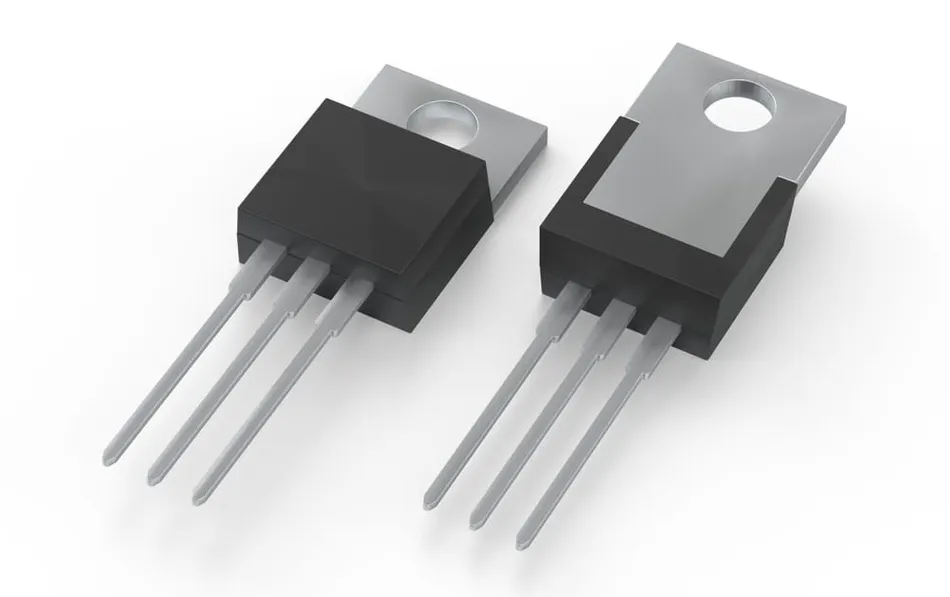
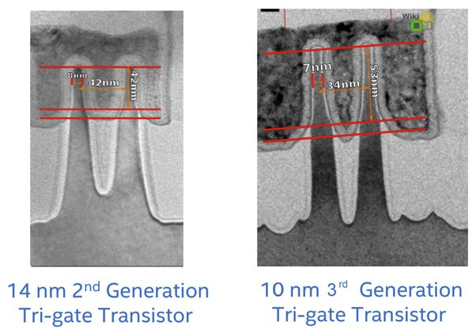
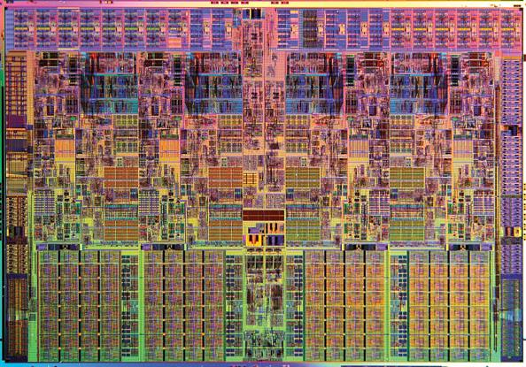
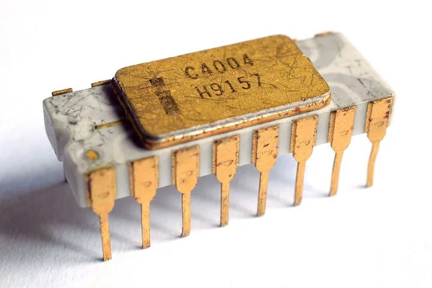
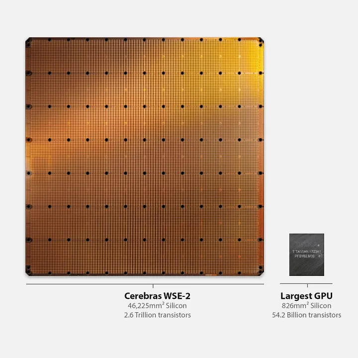

## Why do we need programming?

- Imagine you want to automate a task, like for example u want a weather report every hour. what would u do? 

- If you have given a file containing numbers ranging from 1 to million for example, its not in sorted order and you've been asked to sort them in asscending order. do u think u could do that?

- Imagine you to analyze covid data and make a pie chart showing total number of people got covid respective to their country.
are you of capable going thru millions of lines of data and sorting them according to the country?

## What is programming?

- Programming is nothing but a set of sequential lines of well defined set of statements written in human readable language which performs set of intructions to form a desired output.

## How to program or write code?

- To understand how to write code or program, first let's understand brifly about processors or CPUs.

- To understand about processors or CPUs we to have a little idea about transistors.

- Transistors are tiny electic switches (like ur simple everyday light switch) that can be turned ON or OFF.

Transistor

Single transistor inside a intel processor

How many transistors do you think this processor has?

The first-ever microprocessor

- The first-ever microprocessor(the powerhouse of any electronic gadget) by Intel — The 4004, had 2,300 transistors.

Today's Processor and GPU

- By arranging these tiny transistors into different configurations, CPU designers can create logic gates and circuits that can perform basic and complex operations based on Boolean algebra.

- Processors only understand 0's or 1's. They are known as machine code (binary).

- What is code?
  - Set of well defined statements are called code.

- When bunch of code is put together in a specific seqencial order which meets desired output, we can call it a program.

- Most of all the programs are written in a human readable language known as high level languages.

- There are two types of high level programming languages,
  - Complied -> ex. c#, java, c++
  - Interpreted -> python, javascript  
  - [Refer this to learn how python works](https://www.freecodecamp.org/news/what-is-python-beginners-guide/)

- With the help of any of these high level languages we write a 
set of statements or code that tells the CUPs to do certain desired tasks. This code is known as high level code.

- This high level code is then picked up a programs called compiler which converts high level code into assembly code.

- After which this assembly code is picked up by another program known as Assembler which spits out machine code (binary) from assembly code.

